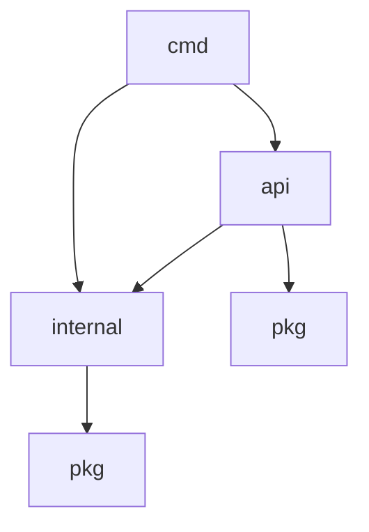

# Proje Yapısı

Bu belge, Go Web projesinin klasör ve dosya yapısını açıklar.

## Genel Bakış

Proje, standart bir Go projesi yapısına göre düzenlenmiştir:

```
.
├── api/          # API endpoint'leri
├── cmd/          # Ana uygulama giriş noktası
├── configs/      # Yapılandırma dosyaları
├── deployments/  # Deployment yapılandırmaları
├── docs/         # Dokümantasyon
├── internal/     # İç paketler
├── pkg/          # Paylaşılan paketler
├── scripts/      # Yardımcı scriptler
├── test/         # Test dosyaları
└── web/          # Web arayüzü dosyaları
```

## Klasör Yapısı Detayları

### api/

API tanımlamalarını ve endpoint işleyicilerini içerir.

```
api/
├── handlers/     # HTTP istek işleyicileri
├── middleware/   # HTTP ara yazılımları
├── routes/       # API rotaları
└── validators/   # İstek doğrulayıcıları
```

### cmd/

Uygulamanın ana giriş noktasını içerir.

```
cmd/
└── main.go       # Ana uygulama başlangıç noktası
```

### configs/

Yapılandırma dosyalarını ve yapılandırma yükleme kodunu içerir.

```
configs/
├── config.go     # Yapılandırma kodu
└── config.yaml   # Varsayılan yapılandırma dosyası
```

### deployments/

Deployment yapılandırmalarını içerir (Docker, Kubernetes vb.).

```
deployments/
├── docker/       # Docker yapılandırması
│   ├── Dockerfile
│   └── docker-compose.yml
└── kubernetes/   # Kubernetes yapılandırması
```

### docs/

Proje dokümantasyonunu içerir.

```
docs/
├── README.md           # Dokümantasyon ana sayfası
├── api-docs.md         # API dokümantasyonu
├── database-schema.md  # Veritabanı şeması
├── installation.md     # Kurulum rehberi
└── project-structure.md # Proje yapısı
```

### internal/

Projenin iç paketlerini içerir. Bu paketler, yalnızca bu proje içinde kullanılabilir.

```
internal/
├── auth/         # Kimlik doğrulama
├── config/       # Dahili yapılandırma
├── database/     # Veritabanı bağlantısı
├── models/       # Veritabanı modelleri
├── repositories/ # Veritabanı işlemleri
└── services/     # İş mantığı
```

### pkg/

Diğer projeler tarafından da kullanılabilecek paylaşılan paketleri içerir.

```
pkg/
├── logger/       # Günlük kaydı
├── utils/        # Yardımcı fonksiyonlar
└── validator/    # Doğrulama fonksiyonları
```

### scripts/

Yardımcı betikleri içerir.

```
scripts/
├── build.sh      # Derleme betiği
├── deploy.sh     # Deployment betiği
└── migrations.sh # Veritabanı migrations betiği
```

### test/

Test dosyalarını içerir.

```
test/
├── integration/  # Entegrasyon testleri
└── unit/         # Birim testleri
```

### web/

Web arayüzü dosyalarını içerir.

```
web/
├── assets/       # Statik dosyalar (CSS, JS, resimler)
├── templates/    # HTML şablonları
└── static/       # Diğer statik dosyalar
```

## Kök Dizindeki Dosyalar

- `.env` - Çevresel değişkenler
- `.gitignore` - Git tarafından yok sayılacak dosyalar
- `go.mod` - Go modül tanımlaması
- `go.sum` - Go bağımlılık toplamları
- `LICENSE` - Lisans dosyası
- `Makefile` - Make komutları
- `README.md` - Proje ana sayfası

## Paket Bağımlılıkları



## Mimari

Proje, temiz bir mimari yaklaşımını takip eder:

1. **Handlers** (api/handlers) - HTTP isteklerini alır ve yanıtları oluşturur
2. **Services** (internal/services) - İş mantığını uygular
3. **Repositories** (internal/repositories) - Veritabanı işlemlerini gerçekleştirir
4. **Models** (internal/models) - Veri yapılarını tanımlar

Bu katmanlı mimari, sorumlulukların net bir şekilde ayrılmasını sağlar ve test edilebilirliği artırır. 